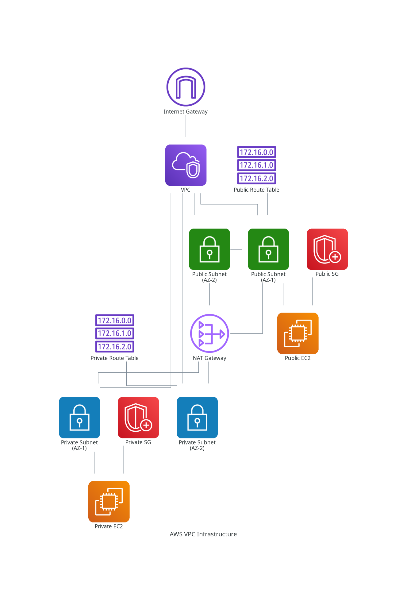

# AWS VPC Infrastructure with Terraform 🚀

## Overview 🌟

This project provides a modular and reusable Terraform configuration for creating a production-grade AWS VPC infrastructure with high availability and security best practices. 🛡️

## Table of Contents 📑
- [Prerequisites](#prerequisites)
- [Features](#features)
- [Logical Flow](#logical-flow)
- [Architecture](#architecture)
- [Key Components](#key-components)
- [Project Structure](#project-structure)
- [Quick Start](#quick-start)
- [Testing the Infrastructure](#testing-the-infrastructure)
- [Cleanup](#cleanup)
- [Contributing](#contributing)
- [Support](#support)
- [License](#license)

## Prerequisites 📋

- 🛠️ Terraform >= 1.0.0
- 🔑 AWS CLI configured with appropriate credentials
- 🐍 Python 3.x (for diagram generation)

## Features ✨

| Feature | Description | Benefits |
|---------|-------------|----------|
| **Modular Design** 🧩 | Each AWS component encapsulated in its own module | Easy to customize and extend |
| **High Availability** 🔄 | Resources distributed across multiple AZs | Improved fault tolerance and reliability |
| **Security Best Practices** 🛡️ | Private subnets, layered security groups, controlled access | Enhanced security posture |
| **Scalability** 📈 | Auto Scaling Group, load balancing | Automatic response to demand |
| **Cost Optimization** 💰 | Single NAT Gateway, configurable instance types | Reduced operational costs |

## Logical Flow 🔄

```
┌─────────────────┐     ┌─────────────────┐     ┌─────────────────┐
│                 │     │                 │     │                 │
│  Internet       │────▶│  Application    │────▶│  EC2 Instances  │
│  Traffic        │     │  Load Balancer  │     │  (Auto Scaling) │
│                 │     │                 │     │                 │
└─────────────────┘     └─────────────────┘     └─────────────────┘
                                                  │
                                                  │
                                                  ▼
┌─────────────────┐     ┌─────────────────┐     ┌─────────────────┐
│                 │     │                 │     │                 │
│  Internet       │◀────│  NAT Gateway    │◀────│  RDS            │
│                 │     │                 │     │  Database       │
│                 │     │                 │     │                 │
└─────────────────┘     └─────────────────┘     └─────────────────┘
```

Data Flow:
1. Internet traffic reaches Application Load Balancer
2. ALB distributes traffic to EC2 instances
3. EC2 instances connect to RDS database
4. RDS outbound traffic flows through NAT Gateway to Internet

## Architecture 🏗️

This infrastructure deploys a production-grade, highly available VPC setup across multiple availability zones. Key components include:

- 🌐 VPC spanning multiple AZs
- 🌍 Public subnets for internet-facing services
- 🔒 Private subnets for internal resources
- 🔄 Route tables with proper subnet associations
- 🛡️ Layered security groups with least-privilege access
- 🌐 Internet Gateway for public subnet access
- 🔀 NAT Gateway for private subnet internet access
- ⚖️ Application Load Balancer for traffic distribution
- 🚀 Auto Scaling Group for application scalability
- 💾 Multi-AZ RDS deployment for high availability



## Key Components 🔑

| Component | Features | Integration |
|-----------|----------|-------------|
| **VPC & Networking** 🌐 | Multi-AZ VPC, public/private subnets, IGW, NAT Gateway | Foundation for all resources |
| **Security Groups** 🛡️ | Layered security, least-privilege access | Protects all AWS resources |
| **Application Load Balancer** ⚖️ | Multi-AZ distribution, health checks | Connects to Auto Scaling |
| **Auto Scaling Group** 📈 | Dynamic capacity, scaling policies | Works with ALB and EC2 |
| **RDS Multi-AZ** 💾 | Primary/standby, automatic failover | Secured in private subnets |
| **EC2 Instances** 🖥️ | Configurable types, user data support | Managed by Auto Scaling |

## Project Structure 📁

```
aws-vpc-terraform/
│── modules/
│   ├── vpc/               # VPC configuration
│   ├── subnets/          # Public and private subnets
│   ├── nat-gateway/      # NAT Gateway for private subnets
│   ├── security-groups/  # Security group definitions
│   ├── ec2/             # EC2 instance configuration
│   ├── alb/             # Application Load Balancer setup
│   ├── autoscaling/     # Auto Scaling Group configuration
│   └── rds/             # RDS Multi-AZ setup
│── assets/
│── main.tf              # Main configuration
│── variables.tf         # Variable definitions
│── outputs.tf           # Output definitions
│── terraform.tfvars     # Variable values
└── README.md
```

## Quick Start 🚀

1. Initialize Terraform:
   ```bash
   terraform init
   ```

2. Review the planned changes:
   ```bash
   terraform plan
   ```

3. Apply the configuration:
   ```bash
   terraform apply
   ```

## Testing the Infrastructure 🧪

### 1. Load Balancer Test
```bash
# Get the ALB DNS name
terraform output alb_dns_name

# Open in browser or use curl
curl http://<alb_dns_name>
```
Expected: HTML page showing instance metadata. Refresh to see responses from different instances.

### 2. Auto Scaling Test
```bash
# Check current instances
aws ec2 describe-instances --filters "Name=tag:Name,Values=my-vpc-autoscaling*" --query 'Reservations[].Instances[].InstanceId'

# Simulate load (replace <alb_dns_name> with actual DNS)
ab -n 10000 -c 100 http://<alb_dns_name>/
```
Watch AWS Console → EC2 → Auto Scaling Groups to observe scaling.

### 3. Health Check Status
```bash
# View target group health
aws elbv2 describe-target-health --target-group-arn $(terraform output -raw alb_target_group_arn)
```

### 4. Logs and Monitoring 📊
- Check instance logs: `/var/log/user-data.log`
- ALB Access Logs: Available in CloudWatch
- Auto Scaling events: AWS Console → EC2 → Auto Scaling Groups → Activity

## Cleanup 🧹

To destroy the infrastructure:
```bash
terraform destroy
```

## Contributing 🤝

1. Fork the repository
2. Create a feature branch
3. Commit your changes
4. Push to the branch
5. Create a Pull Request

## Support 💬

For support, please open an issue in the GitHub repository.

## License 📄

This project is licensed under the MIT License - see the LICENSE file for details.

